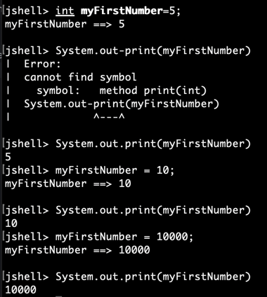

# Introduction
This is the very first practice from the online course Java Masterclass 2025 on Udemy. In this file, the challenges and practices of Java on Jshell is documented.

## Variables
Get familiar with variables. Initialise a variable, change it to ten, then change from tem to ten thousand. And then print the value of the variable
